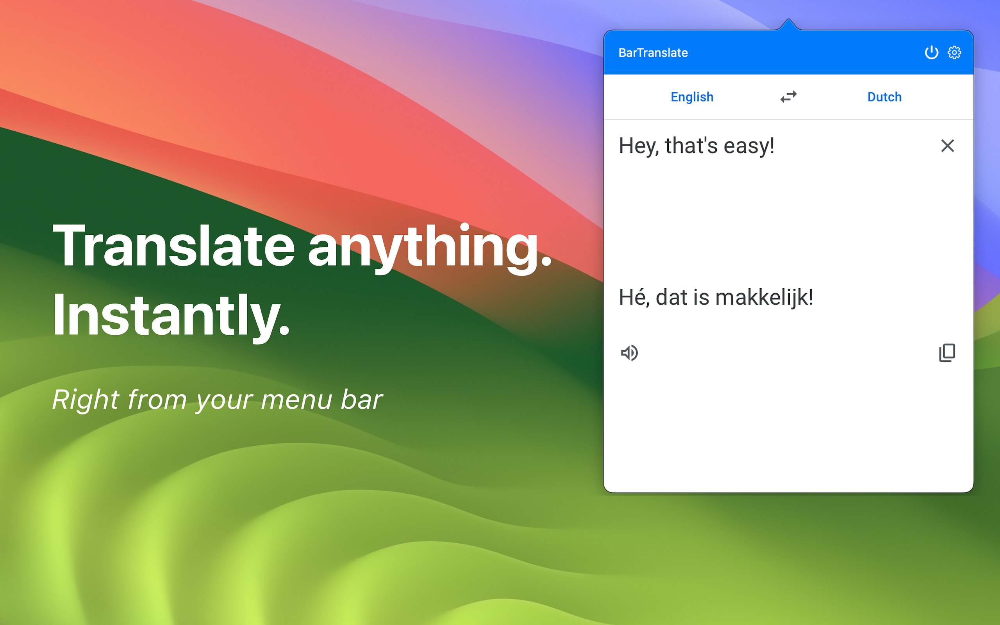
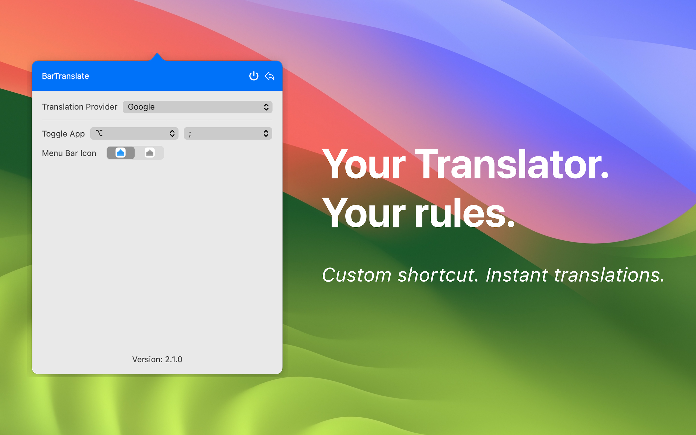

# BarTranslate

🚀 A handy (free) menu bar translator widget for macOS.

    
     
    

Translations are done by presenting a simple (altered) webview of **Google Translate** in a quick and easily accessible interface.

## Download

1. Refer to the [latest releases](https://github.com/ThijmenDam/BarTranslate/releases).
2. Download BarTranslate.zip.
3. Unzip the file.
4. Place BarTranslate.app in your Applications folder.
5. Run BarTranslate.app.
6. Happy translating!

## Features

Feel free to [share your ideas](https://github.com/ThijmenDam/BarTranslate/discussions)!

* Translations via a simple (altered) webview of **Google Translate** in a quick, accessible interface.
* Configurable global hotkeys: toggle the app, translate now, swap languages, translate clipboard, copy result.
* Smart autofocus on the source text field when opening the app.
* Clipboard automation: auto-paste on open and auto-translate clipboard.
* Translation **history** with search/filter and CSV export.
* **Flashcards** with spaced repetition to learn from your translations.
* Text-to-speech, language swap, web dark mode, pinned popover, and launch at login.
* Optional **iCloud sync** of history across your Macs.

## BarTranslate Pro

BarTranslate is free to use, with a **14-day Pro trial** that unlocks every
premium feature. After the trial, Pro features require a one-time unlock:

| Feature | Free | Pro |
| --- | :---: | :---: |
| Core translation, hotkeys, TTS, flashcards | ✅ | ✅ |
| Translation history | up to 50 | up to 200 |
| iCloud sync | — | ✅ |
| CSV export | — | ✅ |
| Priority support | — | ✅ |

Unlock Pro in **Settings ▸ BarTranslate Pro** — purchase a license or enter an
existing license key. The entitlement layer is structured so a Mac App Store
in-app purchase can drive the same unlock.

> **License keys** use the format `BART-XXXX-XXXX-XXXX`. Validation is offline
> for this build; production deployments should additionally verify a signed
> StoreKit receipt or server signature.

## Legal

* [Privacy Policy](PRIVACY.md) — your data stays on your device; no tracking.
* [Terms of Use](TERMS.md)

## Support the author

Like my work? [Consider buying me a coffee!](https://github.com/sponsors/ThijmenDam)
